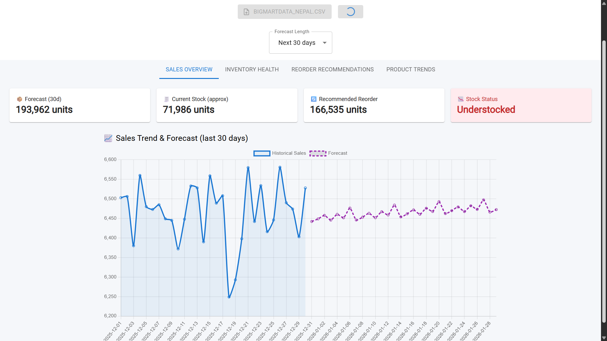

# Smart Inventory Forecast

This project is designed to analyze sales and inventory data using dummy data similar to BigMart sales. It helps businesses forecast stock needs, monitor inventory health, and make reorder recommendations.

## Features

- Analyze sales trends and forecast future demand.
- Monitor current stock and stock status.
- Provide reorder recommendations to avoid understock or overstock.
- Visualize sales trends and inventory health with interactive charts.

## Data

The data used is dummy data created for demonstration purposes. It simulates sales and stock information for a retail business.

## How to Use

1. Load your sales and inventory data (CSV format).
2. Use the forecasting tools to predict future stock needs.
3. Review the dashboard for sales overview, inventory health, and reorder suggestions.

## Screenshot

---

*This project is a simple demo to help understand inventory forecasting and stock management.*
